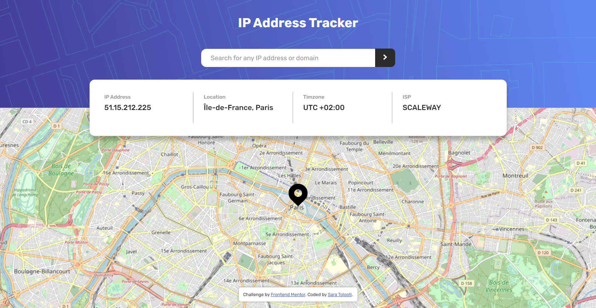

# Frontend Mentor - IP address tracker solution

This is a solution to the [IP address tracker challenge on Frontend Mentor](https://www.frontendmentor.io/challenges/ip-address-tracker-I8-0yYAH0).

## Table of contents

- [The challenge](#the-challenge)
- [Screenshot](#screenshot)
- [Links](#links)
- [Built with](#built-with)
- [Author](#author)

### The challenge

Users should be able to:

- View the optimal layout for each page depending on their device's screen size
- See hover states for all interactive elements on the page
- See their own IP address on the map on the initial page load
- Search for any IP addresses or domains and see the key information and location

### Screenshot

### Links

- [Solution URL](https://www.frontendmentor.io/solutions/responsive-ip-address-tracker-with-async-await-TE3TwHECWr)
- [Live Site URL](https://saratolooti.github.io/Challenges/ip-address-tracker/)

### Built with

- Semantic HTML5 markup
- CSS custom properties
- Flexbox
- Leaflet.js (for the map)
- [API](https://geo.ipify.org/)

## Author

- [Frontend Mentor](https://www.frontendmentor.io/profile/saratolooti)
- [Linkedin](https://www.linkedin.com/in/sara-tolooti-961217212/)
